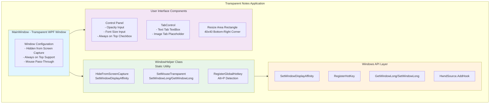
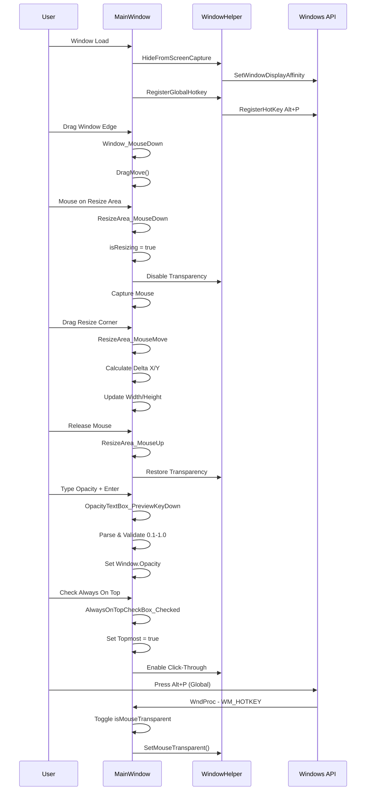
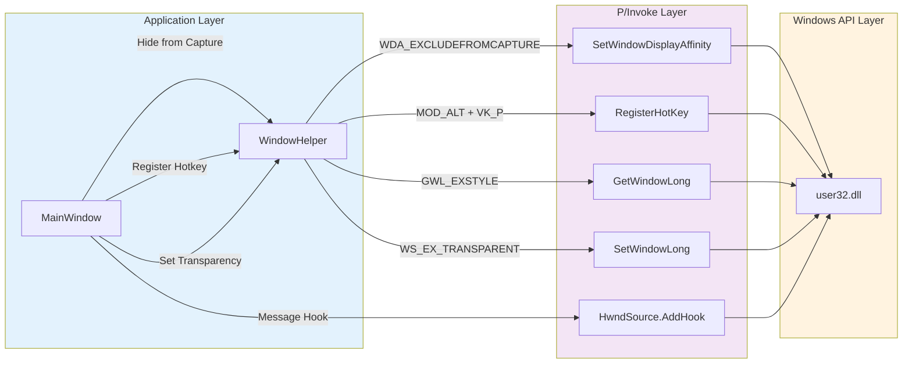
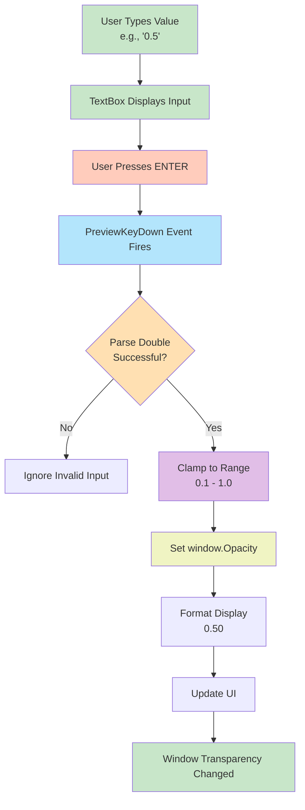
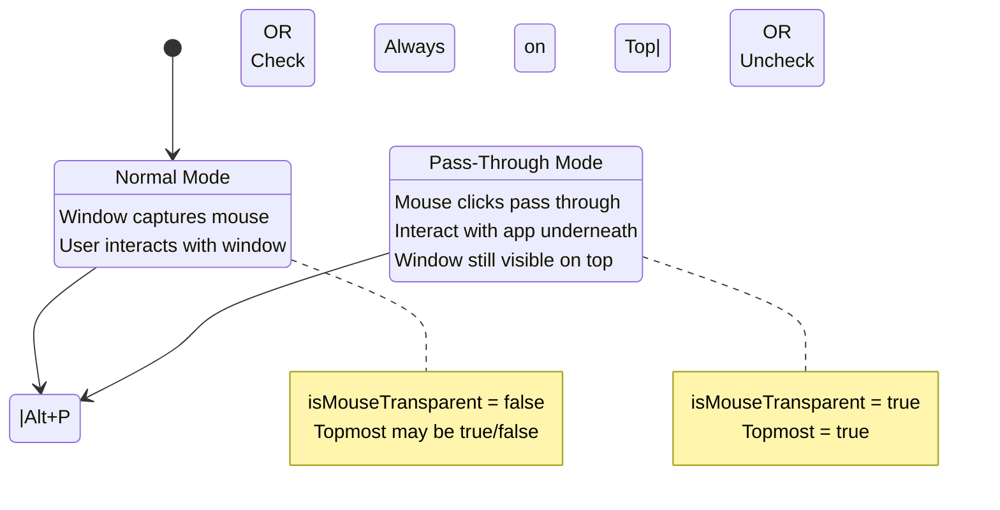
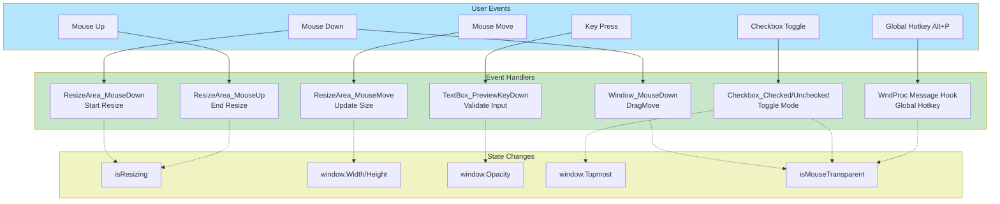

# Transparent Notes App

A sophisticated Windows WPF application that provides a transparent, always-visible notes window that remains hidden from screen capture software (Zoom, Microsoft Teams, Google Meet, etc.).

## Developer

**Created by: Jose Mondragon (MDragon Solutions)**

This application was developed with precision and care to provide a secure notes-taking experience while screen sharing.

## Features

### Core Features
- **Screen Capture Invisible**: The window is completely hidden from screen sharing software (Zoom, Microsoft Teams, Google Meet, OBS, etc.) using Windows API `SetWindowDisplayAffinity`
- **Hidden from Taskbar**: Window doesn't appear in the taskbar - fully stealth mode during screen sharing
- **System Tray Integration**: Access the app via system tray icon (double-click to show/hide, right-click for menu)
- **Transparent Window**: Semi-transparent notes window (adjustable opacity: 0.1 - 1.0) that doesn't interfere with content visibility
- **Rich Text Formatting**: Bold text, bullet lists, and numbered lists with a formatting toolbar
- **Paste from Word/Google Docs**: Supports pasting formatted content including tables from external applications
- **Automatic Note Persistence**: Notes are automatically saved and restored between sessions (stored as RTF)
- **Web Tab with URL Bar**: Type or paste URLs, drag and drop links, browse with transparent background - fully interactive (click links, scroll, fill forms, watch videos)
- **Private Browsing**: WebView2 runs in InPrivate mode - no history, cookies, or cache saved; all data deleted on close
- **Resizable Window**: Drag any of the 4 corner handles to resize the window
- **Draggable Header**: Drag the header bar or toolbar to move the window
- **Always on Top**: Toggle window to stay above all other applications (even PowerPoint presentations)
- **Pass-Through Mode**: Press **Alt+P** to toggle mouse pass-through mode - when enabled, mouse clicks pass through the window to applications underneath
- **Adjustable Opacity**: Use numeric input (0.1 - 1.0) with Enter key to set transparency level
- **Adjustable Font Size**: Use numeric input (8 - 72) with Enter key to change selected text or default size
- **Zoom Support**: Use **Ctrl+Mouse Wheel** to zoom in/out on text and web content
- **Tabbed Interface**: Switch between Text notes, Image content, and Web browser
- **Global Hotkeys**: Alt+P (pass-through), Alt+S (show/front), Alt+H (hide)
- **Code Signed**: Digitally signed with Microsoft Azure Trusted Signing for security and trust

## Quick Start

### System Requirements
- Windows 10 or later
- .NET 10.0 or compatible runtime
- No external dependencies required

### Installation

#### Option 1: Download Release (Recommended)
1. Go to the [Releases](https://github.com/yourusername/TransparentNotesApp/releases) page
2. Download `TransparentNotesApp.exe` (single-file, self-contained)
3. Double-click to run - no installation required!

#### Option 2: Build from Source
1. Clone the repository
2. Navigate to the `TransparentNotesApp` folder
3. Run the application:
   ```bash
   dotnet run
   ```

Or build and publish a release:
```bash
dotnet publish -c Release
# Output: TransparentNotesApp/bin/Release/net10.0-windows/win-x64/publish/TransparentNotesApp.exe
```

## Usage Guide

### Window Controls

| Control | Action | Purpose |
|---------|--------|---------|
| **System Tray Icon** | Double-click | Show/Hide the application window |
| **System Tray Icon** | Right-click | Access menu (Show/Hide, Exit) |
| **Header Bar** | Drag | Move the window |
| **Toolbar** | Drag | Move the window |
| **Corner Handles** | Drag | Resize the window (4 visible corners) |
| **Always on Top Checkbox** | Check/Uncheck | Toggle window to stay above all other windows and enable pass-through mode |
| **Opacity TextBox** | Type value (0.1-1.0) + Enter | Adjust window transparency (0.1 = very transparent, 1.0 = opaque) |
| **Font Size TextBox** | Type value (8-72) + Enter | Change font size of selected text or set default size |
| **Bold Button (B)** | Click | Toggle bold formatting on selected text |
| **Bullet List Button (•)** | Click | Create or toggle bullet list |
| **Numbered List Button (1.)** | Click | Create or toggle numbered list |
| **Web Tab URL Bar** | Type URL + Enter or Go | Navigate to any website |
| **Web Tab** | Drag & drop URL | Load a web page with transparent background |

### Keyboard Shortcuts

| Shortcut | Action |
|----------|--------|
| **Alt+P** | Toggle mouse pass-through mode (global) |
| **Alt+S** | Show window / Bring to front (global) |
| **Alt+H** | Hide window (global) |
| **Ctrl+Mouse Wheel** | Zoom in/out on text and web content |
| **Enter** | Apply value in Opacity/Font Size/URL fields |

### Minimum Window Size
- **Width**: 475 pixels
- **Height**: 100 pixels

## Technical Architecture

### Technologies
- Framework: WPF (Windows Presentation Foundation)
- .NET Version: .NET 10.0 (Windows-specific)
- Language: C# 12
- Windows APIs: P/Invoke for advanced window management

### Key Components

#### WindowHelper Class
Static utility class that handles Windows API interactions:
- `HideFromScreenCapture()`: Uses `SetWindowDisplayAffinity` to hide window from screen capture
- `SetMouseTransparent()`: Uses `SetWindowLong`/`GetWindowLong` with `WS_EX_TRANSPARENT` flag for click-through functionality
- `RegisterGlobalHotkey()`: Registers Alt+P global hotkey
- `UnregisterGlobalHotkey()`: Cleans up hotkey registration

#### MainWindow Class
Main WPF window with event handlers:
- **ResizeArea**: Transparent 40x40 Rectangle overlay in bottom-right corner
  - `ResizeArea_MouseDown()`: Starts resize operation, temporarily disables transparency
  - `ResizeArea_MouseMove()`: Tracks mouse movement and updates window dimensions
  - `ResizeArea_MouseUp()`: Completes resize, re-enables transparency
- **Window_MouseDown()**: Enables window dragging with `DragMove()`
- **Input Handlers**: 
  - `OpacityTextBox_PreviewKeyDown()`: Updates opacity on Enter key
  - `FontSizeTextBox_PreviewKeyDown()`: Updates font size on Enter key
- **Hotkey Handler**: `WndProc()` message hook for global Alt+P detection
- **Checkbox Handlers**: Toggle "Always on Top" and mouse transparency

### XAML Structure
```
MainWindow (Transparent, No Title Bar, Hidden from Taskbar)
├── Grid (2 rows: Auto for controls, * for content)
│   ├── StackPanel (Row 0 - Controls)
│   │   ├── AlwaysOnTopCheckBox + Label + Alt+P Tip
│   │   ├── OpacityTextBox (0.1-1.0)
│   │   └── FontSizeTextBox (8-72)
│   ├── TabControl (Row 1 - Content)
│   │   ├── Text Tab
│   │   │   ├── ToolBar (Bold, Bullet List, Numbered List)
│   │   │   └── RichTextBox (FlowDocument)
│   │   ├── Image Tab (Placeholder)
│   │   └── Web Tab
│   │       └── WebView2 (Drag & drop URL, transparent background)
│   └── ResizeArea (Rectangle overlay - transparent, 40x40)
└── System Tray Icon (NotifyIcon with context menu)
```

### Notes Storage
Notes are automatically saved to:
```
%LOCALAPPDATA%\TransparentNotesApp\notes.rtf
```
(e.g., `C:\Users\YourName\AppData\Local\TransparentNotesApp\notes.rtf`)

---

## Security & Privacy Features

1. **Screen Capture Protection**: Uses Windows native API to exclude window from screen sharing
   - Tested with: Zoom, Microsoft Teams, Google Meet, OBS
   - Note: This only works on Windows; effectiveness may vary by platform/software

2. **Private Web Browsing**: WebView2 runs in InPrivate mode
   - No browsing history saved
   - No cookies persisted after session
   - No cache stored
   - Temp data folder deleted on app close

3. **No Data Transmission**: Application stores data locally only
4. **No External Connections**: Works completely offline (except Web tab)
5. **No Tracking**: Zero telemetry or analytics

## Advanced Features

### Pass-Through Mode
When "Always on Top" is checked:
- Window remains visible above all other applications
- Mouse clicks and interactions pass through to underlying windows
- Perfect for having notes while interacting with applications underneath
- Toggle with Alt+P (works globally)

### Resize Behavior
- Resize handle automatically appears in bottom-right corner
- Transparency temporarily disabled during resize for better visual feedback
- Transparency re-enabled after resize completes
- Minimum dimensions enforced: 475px wide × 100px tall

### Opacity Control
- Enter values between 0.1 and 1.0
- Press Enter to apply changes
- Real-time preview as you type (before pressing Enter)
- Values are automatically clamped to valid range

## Code Quality

### Code Review Results
- Removed: 2 unused slider event handlers (OpacitySlider_ValueChanged, FontSizeSlider_ValueChanged)
- Removed: 2 unused edge detection methods (GetEdgeAtPosition, UpdateCursor)
- Removed: 2 empty event handlers (Window_MouseMove, Window_MouseUp)
- Fixed: 1 duplicate WM_HOTKEY constant definition
- Cleaned: Removed 7 unused using statements (System.Text, System.Windows.Data, System.Windows.Documents, System.Windows.Media, System.Windows.Media.Imaging, System.Windows.Navigation)
- Result: Clean, maintainable codebase with no dead code

## Known Limitations

1. Image Tab: Currently a placeholder - can be extended to load and display images
2. Windows Only: Application requires Windows OS and relies on Windows-specific APIs
3. Screen Capture Evasion: Effectiveness depends on the specific screen sharing software and its implementation

## Version History

### v1.3 (Current)
- **Web Tab Enhancements**:
  - Added URL bar for typing/pasting URLs
  - Private browsing mode (InPrivate WebView2) - no history, cookies, or cache saved
  - Fully interactive web pages (click links, scroll, fill forms, watch videos)
  - Auto-cleanup of temp data on app close
- **Window Improvements**:
  - Corner resize handles (4 visible corners)
  - Drag header or toolbar to move window
  - Stays on top even against fullscreen apps (PowerPoint presentations)
  - More transparent control backgrounds
- **Global Hotkeys**:
  - Alt+S: Show window / Bring to front
  - Alt+H: Hide window
- **Zoom Support**: Ctrl+Mouse Wheel to zoom text and web content
- Fixed font size to apply to selected text

### v1.2
- Added Web tab with drag-and-drop URL loading
- WebView2 integration with transparent background for web pages
- Hidden from taskbar for complete stealth during screen sharing
- System tray icon with show/hide and exit options
- Fixed font size to apply to selected text (not just new text)
- Increased max font size from 32 to 72

### v1.1
- Added rich text formatting (bold, bullet lists, numbered lists)
- Added automatic note persistence (saves/loads RTF format)
- Added paste support for formatted content from Word/Google Docs
- Added formatting toolbar
- Configured single-file self-contained executable
- Added Azure Trusted Signing for code signing
- Added GitHub Actions workflow for automated signed releases
- Added application icon

### v1.0
- Initial release
- Core features implemented: screen capture hiding, transparency, resizing, pass-through mode
- Numeric controls for opacity and font size (instead of sliders)
- Global Alt+P hotkey for pass-through toggle

## Contributing

This is a personal portfolio project by José Mondragon (MDragon Solutions). 

Suggestions for improvements:
- Implement color themes
- Add more keyboard shortcuts (Ctrl+B for bold, etc.)
- Extend Image tab functionality
- Add italic and underline formatting

## License

This project is created by José Mondragon (MDragon Solutions) for portfolio purposes.

**Created by: José Mondragon - MDragon Solutions**

## Future Enhancements

- Custom themes (dark mode, colors)
- Note templates
- Auto-backup feature
- Search functionality
- Markdown support
- Cloud sync (optional)
- Note encryption
- Export to PDF/TXT
- Italic and underline formatting
- Keyboard shortcuts for formatting (Ctrl+B, Ctrl+I, etc.)

## Project Structure

```
TransparentNotesApp/
├── .github/
│   └── workflows/
│       └── release.yml      # GitHub Actions for signed releases
├── TransparentNotesApp/
│   ├── MainWindow.xaml      # UI Layout definition
│   ├── MainWindow.xaml.cs   # Main window logic & event handlers
│   ├── App.xaml             # Application resources
│   ├── App.xaml.cs          # Application startup logic
│   ├── AssemblyInfo.cs      # Assembly metadata
│   ├── app.ico              # Application icon
│   └── TransparentNotesApp.csproj # Project configuration
└── TransparentNotesApp.Tests/
    └── MainWindowTests.cs   # Unit tests
```

## Windows APIs Used

- SetWindowDisplayAffinity: Hide window from screen capture
- GetWindowLong/SetWindowLong: Manage extended window styles
- WS_EX_TRANSPARENT: Extended window style for click-through
- RegisterHotKey/UnregisterHotKey: Global hotkey registration
- HwndSource.AddHook: Message interception for hotkey handling

## Architecture Diagrams

### System Architecture



### Event Flow Diagram



### Windows API Integration Diagram



### Data Flow - Opacity Control



### Pass-Through Mode State Machine



### Component Interaction Diagram



**Last Updated**: January 8, 2026
**Created by**: José Mondragon - MDragon Solutions
**Project Type**: WPF Desktop Application (.NET 10.0)

