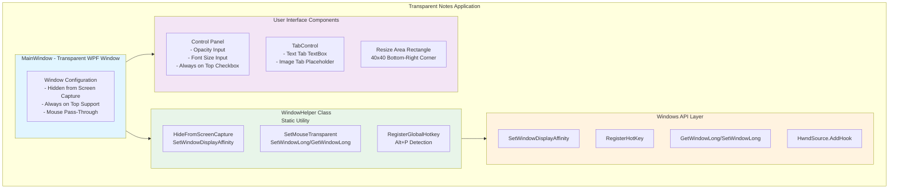
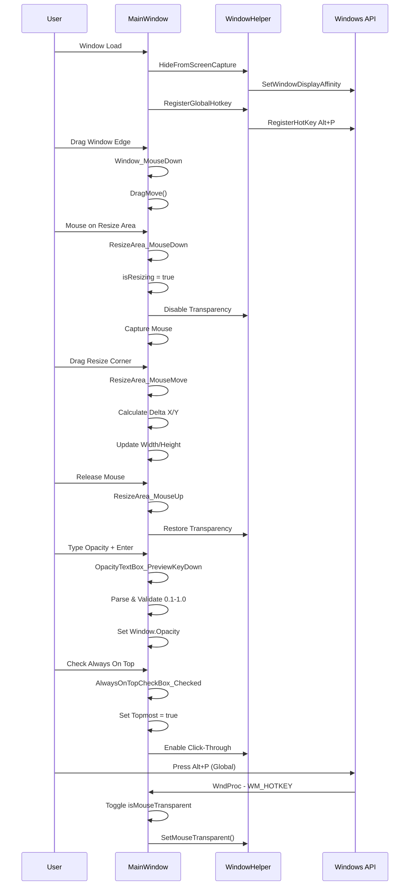
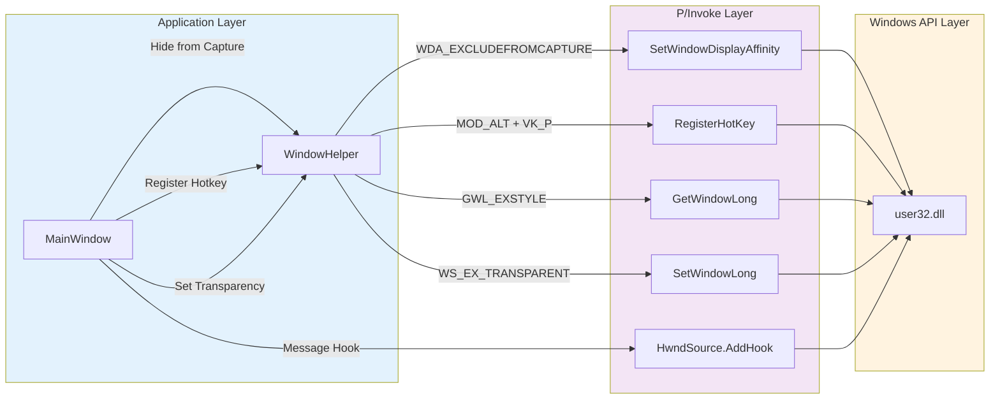
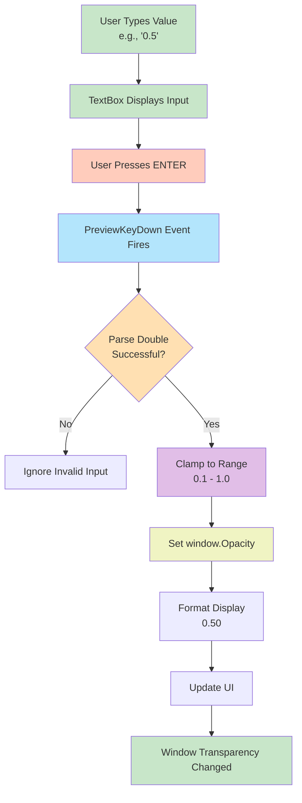
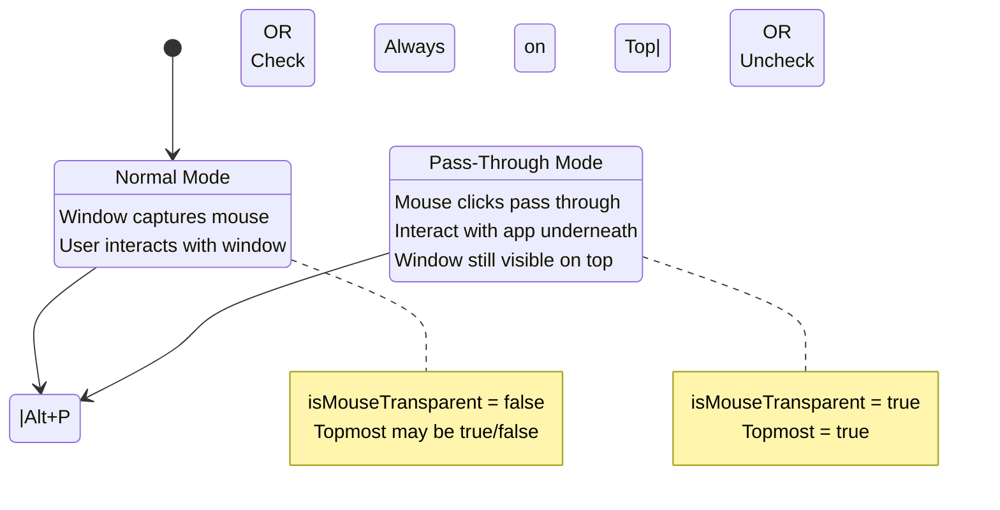
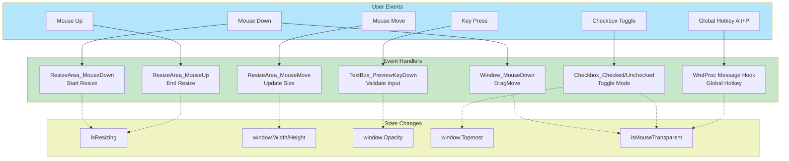

# Transparent Notes App

A sophisticated Windows WPF application that provides a transparent, always-visible notes window that remains hidden from screen capture software (Zoom, Microsoft Teams, Google Meet, etc.).

## Developer

**Created by: Jose Mondragon (MDragon Solutions)**

This application was developed with precision and care to provide a secure notes-taking experience while screen sharing.

## Features

### Core Features
- **Screen Capture Invisible**: The window is completely hidden from screen sharing software (Zoom, Microsoft Teams, Google Meet, OBS, etc.) using Windows API `SetWindowDisplayAffinity`
- **Transparent Window**: Semi-transparent notes window (adjustable opacity: 0.1 - 1.0) that doesn't interfere with content visibility
- **Resizable Window**: Drag the bottom-right corner to resize the window to fit your needs
- **Always on Top**: Toggle window to stay above all other applications
- **Pass-Through Mode**: Press **Alt+P** to toggle mouse pass-through mode - when enabled, mouse clicks pass through the window to applications underneath
- **Adjustable Opacity**: Use numeric input (0.1 - 1.0) with Enter key to set transparency level
- **Adjustable Font Size**: Use numeric input (8 - 32) with Enter key to change note text size
- **Tabbed Interface**: Switch between Text notes and Image content (expandable feature)
- **Keyboard Shortcut**: Global Alt+P hotkey works even when window is in pass-through mode

## Quick Start

### System Requirements
- Windows 10 or later
- .NET 10.0 or compatible runtime
- No external dependencies required

### Installation

1. Download or clone the repository
2. Navigate to the `TransparentNotesApp` folder
3. Run the application:
   ```bash
   dotnet run
   ```

Or build and run:
```bash
dotnet build
cd bin/Debug/net10.0-windows
TransparentNotesApp.exe
```

## Usage Guide

### Window Controls

| Control | Action | Purpose |
|---------|--------|---------|
| **Always on Top Checkbox** | Check/Uncheck | Toggle window to stay above all other windows and enable pass-through mode |
| **Opacity TextBox** | Type value (0.1-1.0) + Enter | Adjust window transparency (0.1 = very transparent, 1.0 = opaque) |
| **Font Size TextBox** | Type value (8-32) + Enter | Change the size of text in the notes area |
| **Alt+P Hotkey** | Press anywhere | Toggle pass-through mode (allows clicks to pass through window) |
| **Bottom-Right Corner** | Drag | Resize the window to your desired dimensions |

### Keyboard Shortcuts

- **Alt+P**: Toggle mouse pass-through mode globally
- **Enter** (in Opacity/Font Size fields): Apply the numeric input value

### Minimum Window Size
- **Width**: 475 pixels
- **Height**: 100 pixels

## Technical Architecture

### Technologies
- Framework: WPF (Windows Presentation Foundation)
- .NET Version: .NET 10.0 (Windows-specific)
- Language: C# 12
- Windows APIs: P/Invoke for advanced window management

### Key Components

#### WindowHelper Class
Static utility class that handles Windows API interactions:
- `HideFromScreenCapture()`: Uses `SetWindowDisplayAffinity` to hide window from screen capture
- `SetMouseTransparent()`: Uses `SetWindowLong`/`GetWindowLong` with `WS_EX_TRANSPARENT` flag for click-through functionality
- `RegisterGlobalHotkey()`: Registers Alt+P global hotkey
- `UnregisterGlobalHotkey()`: Cleans up hotkey registration

#### MainWindow Class
Main WPF window with event handlers:
- **ResizeArea**: Transparent 40x40 Rectangle overlay in bottom-right corner
  - `ResizeArea_MouseDown()`: Starts resize operation, temporarily disables transparency
  - `ResizeArea_MouseMove()`: Tracks mouse movement and updates window dimensions
  - `ResizeArea_MouseUp()`: Completes resize, re-enables transparency
- **Window_MouseDown()**: Enables window dragging with `DragMove()`
- **Input Handlers**: 
  - `OpacityTextBox_PreviewKeyDown()`: Updates opacity on Enter key
  - `FontSizeTextBox_PreviewKeyDown()`: Updates font size on Enter key
- **Hotkey Handler**: `WndProc()` message hook for global Alt+P detection
- **Checkbox Handlers**: Toggle "Always on Top" and mouse transparency

### XAML Structure
```
MainWindow (Transparent, No Title Bar)
├── Grid (2 rows: Auto for controls, * for content)
│   ├── StackPanel (Row 0 - Controls)
│   │   ├── AlwaysOnTopCheckBox + Label
│   │   ├── OpacityTextBox (0.1-1.0)
│   │   └── FontSizeTextBox (8-32)
│   ├── TabControl (Row 1 - Content)
│   │   ├── Text Tab (TextBox for notes)
│   │   └── Image Tab (Placeholder)
│   └── ResizeArea (Rectangle overlay - transparent, 40x40)
```

---

## Security & Privacy Features

1. Screen Capture Protection: Uses Windows native API to exclude window from screen sharing
   - Tested with: Zoom, Microsoft Teams, Google Meet, OBS
   - Note: This only works on Windows; effectiveness may vary by platform/software

2. No Data Transmission: Application stores data locally only
3. No External Connections: Works completely offline
4. No Tracking: Zero telemetry or analytics

## Advanced Features

### Pass-Through Mode
When "Always on Top" is checked:
- Window remains visible above all other applications
- Mouse clicks and interactions pass through to underlying windows
- Perfect for having notes while interacting with applications underneath
- Toggle with Alt+P (works globally)

### Resize Behavior
- Resize handle automatically appears in bottom-right corner
- Transparency temporarily disabled during resize for better visual feedback
- Transparency re-enabled after resize completes
- Minimum dimensions enforced: 475px wide × 100px tall

### Opacity Control
- Enter values between 0.1 and 1.0
- Press Enter to apply changes
- Real-time preview as you type (before pressing Enter)
- Values are automatically clamped to valid range

## Code Quality

### Code Review Results
- Removed: 2 unused slider event handlers (OpacitySlider_ValueChanged, FontSizeSlider_ValueChanged)
- Removed: 2 unused edge detection methods (GetEdgeAtPosition, UpdateCursor)
- Removed: 2 empty event handlers (Window_MouseMove, Window_MouseUp)
- Fixed: 1 duplicate WM_HOTKEY constant definition
- Cleaned: Removed 7 unused using statements (System.Text, System.Windows.Data, System.Windows.Documents, System.Windows.Media, System.Windows.Media.Imaging, System.Windows.Navigation)
- Result: Clean, maintainable codebase with no dead code

## Known Limitations

1. Image Tab: Currently a placeholder - can be extended to load and display images
2. Persistence: Notes content is not saved between sessions (can be added via serialization)
3. Windows Only: Application requires Windows OS and relies on Windows-specific APIs
4. Screen Capture Evasion: Effectiveness depends on the specific screen sharing software and its implementation

## Version History

### v1.0 (Current)
- Initial release
- Core features implemented: screen capture hiding, transparency, resizing, pass-through mode
- Numeric controls for opacity and font size (instead of sliders)
- Global Alt+P hotkey for pass-through toggle

## Contributing

This is a personal portfolio project by José Mondragon (MDragon Solutions). 

Suggestions for improvements:
- Add note persistence (JSON/SQLite storage)
- Implement color themes
- Add more keyboard shortcuts
- Extend Image tab functionality
- Add system tray integration

## License

This project is created by José Mondragon (MDragon Solutions) for portfolio purposes.

**Created by: Jose Mondragon - MDragon Solutions**

## Future Enhancements

- Save/Load notes functionality
- Custom themes (dark mode, colors)
- Note templates
- Auto-backup feature
- Search functionality
- Markdown support
- System tray minimization
- Cloud sync (optional)
- Note encryption
- Export to PDF/TXT

## Project Structure

```
TransparentNotesApp/
├── MainWindow.xaml          # UI Layout definition
├── MainWindow.xaml.cs       # Main window logic & event handlers
├── App.xaml                 # Application resources
├── App.xaml.cs              # Application startup logic
├── AssemblyInfo.cs          # Assembly metadata
├── TransparentNotesApp.csproj # Project configuration
└── bin/                     # Build output
```

## Windows APIs Used

- SetWindowDisplayAffinity: Hide window from screen capture
- GetWindowLong/SetWindowLong: Manage extended window styles
- WS_EX_TRANSPARENT: Extended window style for click-through
- RegisterHotKey/UnregisterHotKey: Global hotkey registration
- HwndSource.AddHook: Message interception for hotkey handling

## Architecture Diagrams

### System Architecture



### Event Flow Diagram



### Windows API Integration Diagram



### Data Flow - Opacity Control



### Pass-Through Mode State Machine



### Component Interaction Diagram



**Last Updated**: December 25, 2025
**Created by**: Jose Mondragon - MDragon Solutions
**Project Type**: WPF Desktop Application (.NET 10.0)

